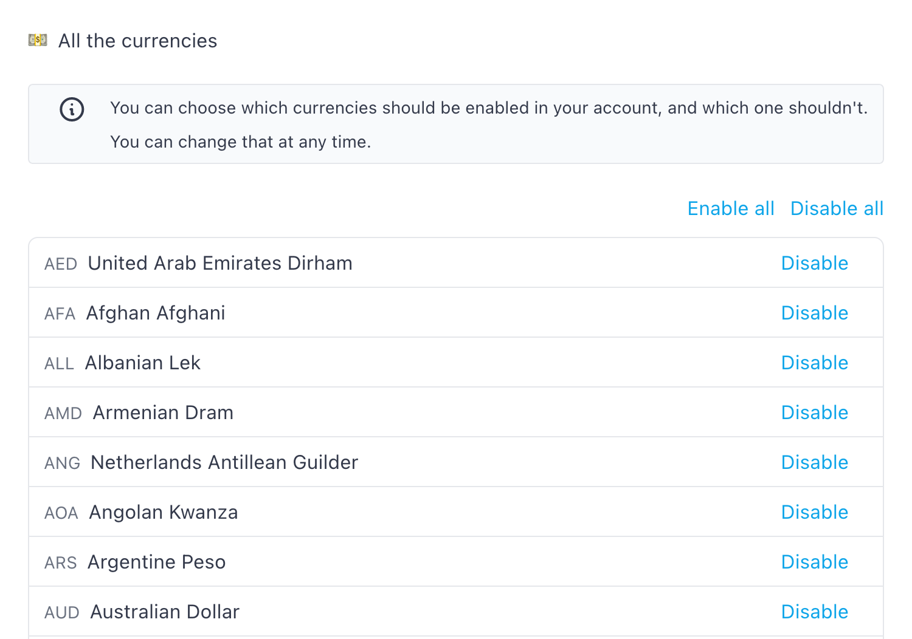

# Manage currencies

There are several parts in Monica where you can indicate a currency (loans, for instance). There are [many, many currencies](https://en.wikipedia.org/wiki/List\_of\_circulating\_currencies) in the world – 130 in fact. There are very good chances that you don't need all those currencies in your account, even though Monica supports them all.

In your `Settings > Personalize your account > Currencies` page, you can enable or disable the currencies you want to use in your account. Every user in the account will inherit these settings.

You can also disable them all, or enable them all. It's up to you.

If you disable a currency that were previously used, for instance in a loan, your currency will still be available when editing this loan.

<figure><figcaption></figcaption></figure>

\
