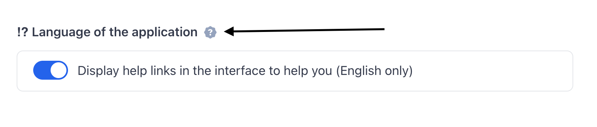
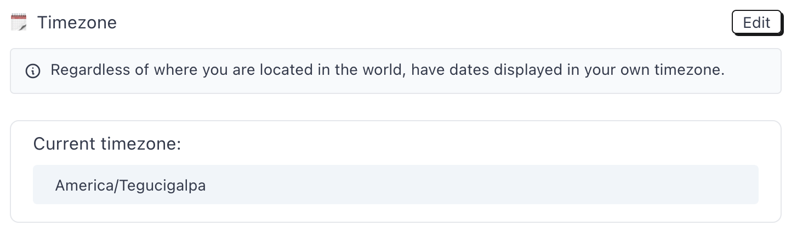

# Manage preferences

In the Settings section, every user in the account can customize his/her account in order to match his/her taste. This happens under `Settings > User preferences`.


Each setting under this section are defined per user, and won't affect other users of the same account.


### Help display

While we hope Monica is easy to use and doesn't need any explanation, there might be some time where you will want to have more information about a feature. This is exactly the reason we have this documentation portal.

We've tried to write some help documentation for every feature. Next to each feature, we've added a little question mark, as shown below.

<figure><figcaption><p>An example of the question mark linking to the documentation</p></figcaption></figure>

Clicking on a link will send you to the right place in the documentation.

For advanced users, this might not be an option that you will use. This is why we've included the possibility to hide completely the help link in the user interface.

### Language <a href="#language" id="language"></a>

Monica's original language is in English, but our community has translated the application into other languages. You can change the language whenever you want, and the change will be effective immediately.


Sometimes you will notice that some words in the application are not translated to your language. For instance, if you create your account in the English language, Monica will populate the account with default parameters, like the names of tabs that appear on a contact sheet for instance.\
Because everything is customizable and you can rename these names, we can't translate them for you with the new language, unfortunately. You will have to change the translations yourself in your account preferences.


### Customize contact names[​](https://docs.monicahq.com/docs/account-settings/manage-preferences#customize-contact-names) <a href="#customize-contact-names" id="customize-contact-names"></a>

In the US, contacts are represented by `<First name><Last name>`, like James Bond. However, not everyone lives in the US, and the way names should be ordered is different amongst the different cultures on Earth.

We want Monica to be as flexible as possible, so we invented a way, perhaps a bit complex, to let you manage this at your leisure.

Under `Settings > User preferences`, you can define how Monica should represent names for you.


This setting is a personal settings, not an account-wide settings. The way names should be represented is not necessarily the way other users in the same account want to see how names should be displayed. In the same account, users can have different ways of displaying contact names.


#### Use a preset

By default, users can use one of the presets we've put at your disposal, but you can create your own preset if you want. Let's take an example with a contact to illustrate what we mean, with the following example:

| First name | Last name | Maiden name | Nickname | Middle name |
| ---------- | --------- | ----------- | -------- | ----------- |
| James      | Bond      | John        | 007      | W.          |

The default presets would give the following results:

* `<First name> <Last name>`: **James Bond**
* `<Last name> <First name>`: **Bond James**
* `<First name> <Last name> <Nickname>`: **James Bond 007**
* `<First name> <Nickname> <Last name>`: **James 007 Bond**

#### Create your own preset <a href="#create-your-own-preset" id="create-your-own-preset"></a>

You can create your own name order, if you want. This is a bit complex, but worth it if it's important to you.

To create your own name order, you have to compose the name using variables, like this:

```
%first_name% %last_name% (%nickname%)
```

You can also add as many characters as you want (spaces, parenthesis,…), and these characters will be represented in the name as well.

The code above will generate the following name `James Bond (007)`.

Here are the different variables we currently support that you can use to compose your preset with:

* `%first_name%`
* `%last_name%`
* `%nickname%`
* `%maiden_name%`
* `%middle_name%`

You can also add as many characters as you want (spaces, parenthesis,…), and these characters will be represented in the name as well.


Make sure to always use the `%` character for each variable name, otherwise it won't work.


If the contact doesn't have one of those field filled, we'll simply ignore the field when the name is displayed.

### Date format

Dates, like contact names, is culture-based. Because of that, we've added the possibility the customize the way all the dates are displayed in the application. Once it's set, all the dates, throughout the entire application, will be displayed using your own preference.

You can choose between four different formats:

* Aug 01, 2022 `(MM DD, YYYY)`
* 01 Aug 2022 `(DD MM YYYY)`
* 2022/08/01 `(YYYY/MM/DD)`
* 01/08/2022 `(DD/MM/YYYY)`

When relevant, those dates also take into account the timezone that you've chosen.

### Numerical format[​](https://docs.monicahq.com/docs/account-settings/manage-preferences#numerical-format) <a href="#numerical-format" id="numerical-format"></a>

You can choose to display numerical values in the format that you want. Monica currently supports the following format:

* `1,234.56`
* `1 234,56`
* `1234.56`

Every single number displayed in the app (except phone numbers) will be displayed using the format you chose above.

### Timezone

Not everyone lives in the UTC timezone. Monica's users come from all over the world. Therefore, we need to let users manage their timezones. By default, UTC is the timezone for all users.

<figure><figcaption></figcaption></figure>

Changing timezone will affect all the dates that are displayed in the application, and will dictate at which time of the day we should send you the different reminders that you might define in your account.

### Maps preferences <a href="#maps-preferences" id="maps-preferences"></a>

Monica uses maps here and there for some features. For instance, an address is clickable and will open a map.

Maps can be opened using two services and you have to choose one:

* Google Maps
* Open Street Maps (the default value)

Google Maps is way more precise, but is a nightmare for privacy. Basically, all your searches will end up in the ads business that Google runs. If that's ok with you, use this option.

Open Street Maps is more private friendly, but way less precise.
