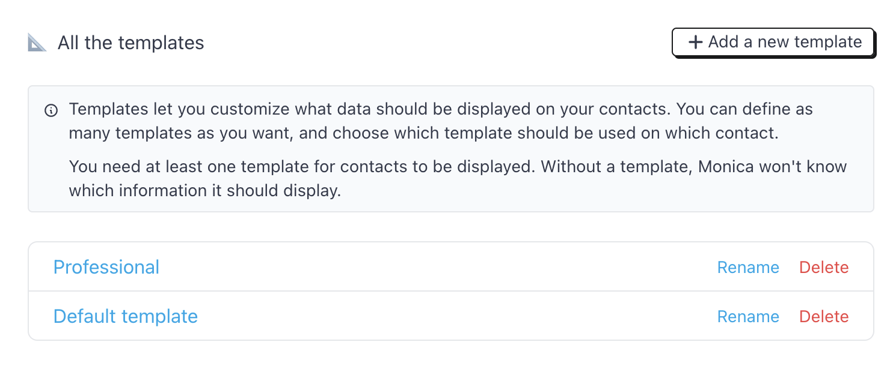
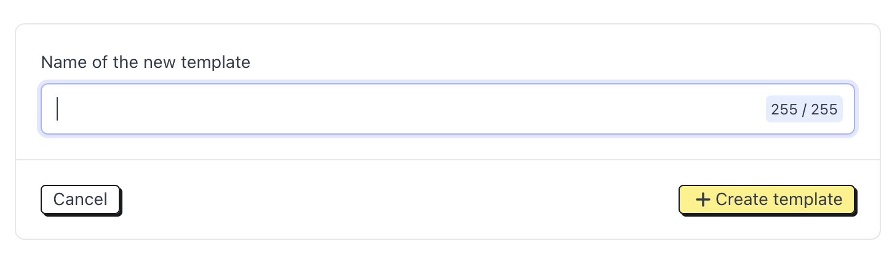
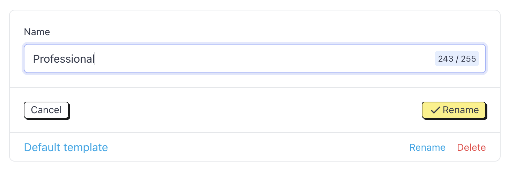

# Manage templates

## Introduction

What you want to record about your contacts differs from what I want to record about mine. We can go further: you may want to approach professional contacts differently than personal ones.

To help you with this, Monica comes with different concepts: templates, pages and modules.

Let’s analyze that.

* Templates show us what data to display when viewing a contact and how it should be displayed. Each contact is associated with a single template, which can be changed at any time.
* Templates contain pages. Each page represents a category of data that we group together. Think of them as "tabs". For example, a page named "Social" might contain activities and a list of friends associated with a contact.
* Finally, we have modules. A module is a set of data about a contact: life events, reminders, photos etc…

Monica comes with a default template, pages, and modules. We suggest taking some time to create additional templates to customize it to your liking.

Once you have at least two templates in your account, you can decide which contacts should be assigned with which templates. This is defined at the contact level, when viewing the contact page.

## Managing contact templates

### Create a template

To create a template, head over to Settings > Personalize your account > Templates. This is what you will see.

<figure><figcaption></figcaption></figure>

Then, click on the Add a new template button.

<figure><figcaption></figcaption></figure>

Here, you simply need to add the name of the template to create the template.

You can have as many templates as you want in your account.

### Renaming a template

A template can be renamed any time you want. This can only be done by the account administrator.

To rename a template, go to Settings > Personalize your account > Templates and find the template you would like to rename. Then, click on the Rename button to edit the template’s name.

<figure><figcaption></figcaption></figure>


The change will take effect immediately. Renaming the template won't affect the content of the template or any contacts that use it.


### Deleting a template

To delete a template, go to Settings > Personalize your account > Templates and find the template you would like to delete. Locate the Delete button and click on it to proceed.


Deleting a template has a single consequence: all contacts associated with it will no longer have a template. Technically, a contact needs one template before it can be displayed. If you click on a contact that has no template, Monica will ask you to assign a new one.

