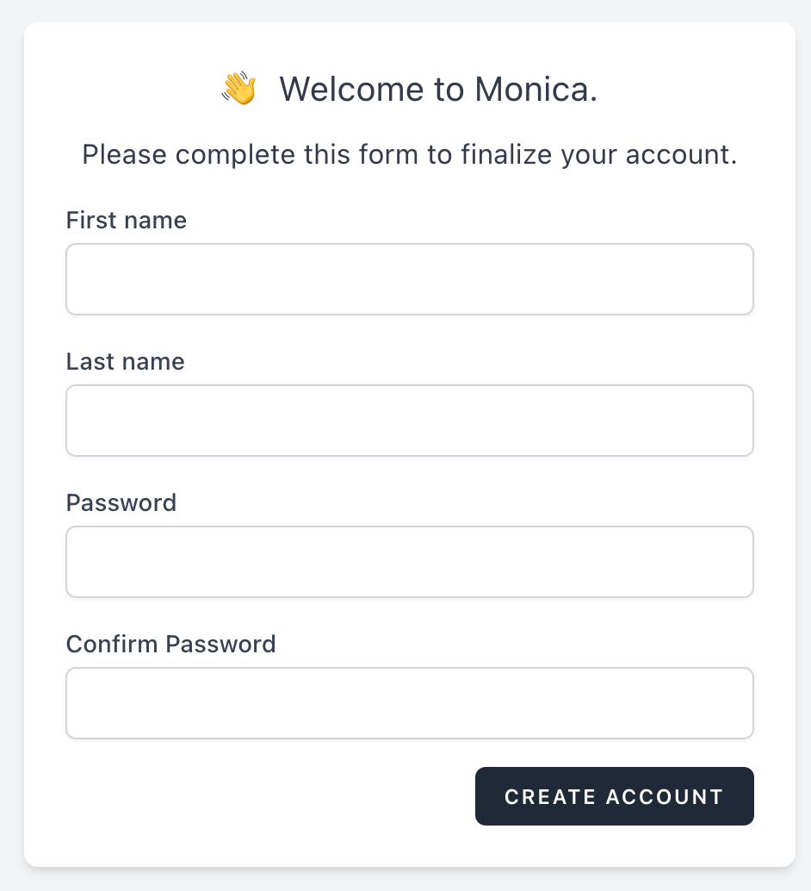

# Manage users

In Monica, we support multiple users per account. Users can have two different permissions:

* administrator: they have the ability to manage other users, manage billing and manage account settings
* regular user: they have the ability to create their own vaults and do whatever they like with them

### Adding users

Adding users to your account in Monica can only be done by an account administrator. The flow for adding users is simple:

* you need to enter an email address where the invitation will be sent to.
* you need to indicate which permission the user will have.
* you click on Send, and if the email address is valid, the person will receive a link that will allow them to create their account.

Note that the email address of the person should not already exist in Monica by someone else, even in another account.

<figure><figcaption></figcaption></figure>

Once the invited user clicks on the invitation link, this is the form that they will have to complete.

### Deleting users

Deleting users in Monica is a little bit complex as it follows a certain set of rules:

* only administrators can delete another user
* as an administrator, you can't delete yourself

There are also additional rules about vaults. When you delete another user, Monica will delete all the vaults where:

* the given user is the manager of the vault
* and the vault has no other vault managers other than the given user


To be clear: all the vaults for which the user was the sole manager of will be completely deleted. For all the other vaults, the user will simply be removed from the vault.


To delete a user, you need to use the Delete option on the `Settings > Manage users` screen.

Deleting a user happens immediately.
