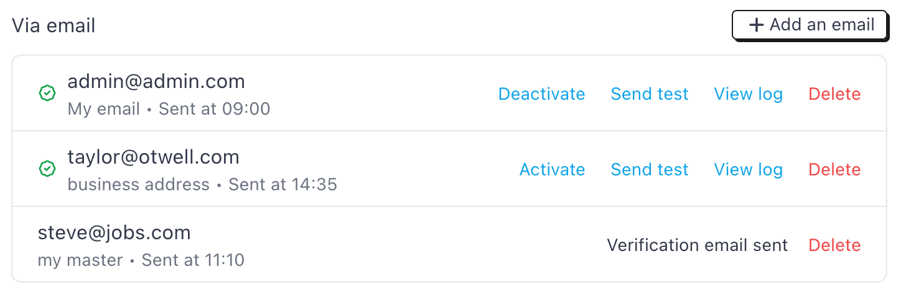
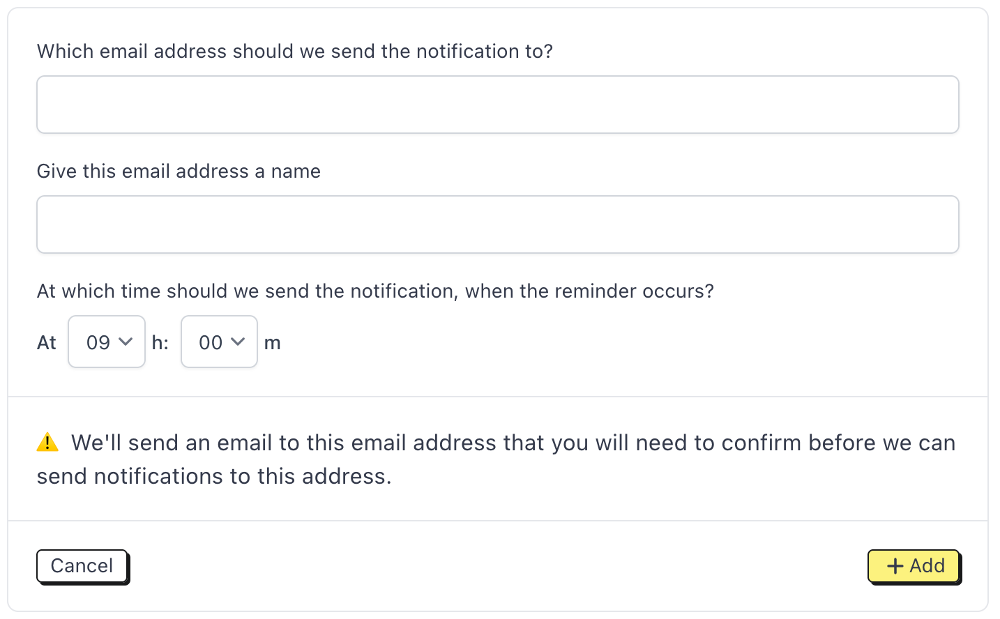
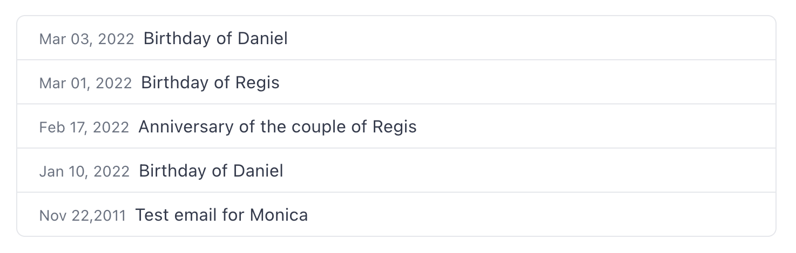

# Notification channels

Monica lets you setup reminders. You can read more about reminders here.

Reminders, by nature, are meant to be sent somehow, once they are triggered. Monica provides several ways for all users in the account to be notified: via email and Telegram for now, and perhaps in the future: Messenger, Teams, Slack, SMS.

We call this a notification channel. You, as a user, can setup as many notification channels as you like. Also, each user in the account will have different notification channels. It's up to each user of an account to setup his/her own notification channels.

By default, upon account creation, each user has had to register an account with his/her email address. This email address will be used as the first notification channel for this user in the account. You can, of course, disable this notification channel if you so desire.

### Email notification channel 

Email is the most natural notification channel. You can define as many emails as you want, and reminder will be sent to each defined email address.

For each email address, you can indicate the precise hour and minute you would like to receive the notification the day the reminder is supposed to be sent. This time will take your timezone into account, if it's defined, of course.

#### Anatomy of the notification channel list 

<figure><figcaption></figcaption></figure>

#### Adding a new email address 

To add a new email address, click on the Add an email button.

<figure><figcaption></figcaption></figure>

* You need to specify the email address. The email address should not be used in the account already.
* You need to specify a label for this address. This is like a friendly name that we will use to identify the email address.
* You need to indicate the time for when you would like to receive the notification.

Once this is setup, Monica will send a verification email to this email address, so we know that you own it. No reminders will be sent to the address if it's not verified first.

#### Deleting an email address 

You can delete an email address. Once it's deleted, you'll never receive notifications on it ever again.

#### Activating/deactivating an email address

Sometimes, you want to be able to deactivate an email address from receiving a notification. Simply click on Deactivate to do so. If it's deactivated, no notification will be send. You can reactivate it anytime you want.

### Send tests and logs 

If you want to test a notification channel, you can send a test notification and your channel should receive it, regardless of what the channel is. This lets you verify that the channel actually works.

Another useful tool is the ability to see the logs of all the notifications we have sent through the given notification channel. For instance, the email notification channel logs page looks like the following:

<figure><figcaption></figcaption></figure>

We keep the history of all the logs that have been sent forever, unless the notification channel is deleted - in this case, logs will be also lost forever.
